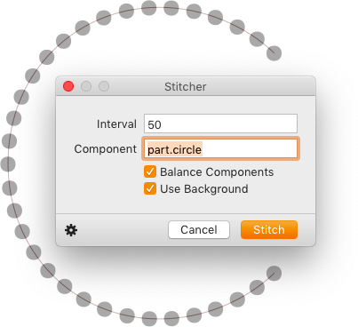

# Stitcher

This is a plugin for the [Glyphs font editor](http://glyphsapp.com/) by Georg Seifert. After installation, it will add the menu item *Filter > Stitcher.* You can set a keyboard shortcut in System Preferences. The plug-in will distribute components along an (open) path:

### Installation

1. One-click install *Stitcher* from *Window > Plugin Manager*
2. Restart Glyphs.

### Usage Instructions

1. Open at least one glyph in Edit View.
2. *Filter > Stitcher:*
  * Set an *Interval:* intended distance between component origins in units
  * Set a *Component:* the name of a gyph you want to insert as component. It will be placed on the path by its origin point, which is either  x=0/y=0 or where an anchor called `origin` is placed inside the original glyph.
  * *Balance Components:* whether or not the distribution of the nodes should be strtetched out across the paths in such a way that the first and last node of each path will always have a component. Of course, the actual interval distance will not be met exactly anymore.
  * *Use Background:* Will move the paths in the background and use them from there. Foreground only has components, and will be overwritten. Useful for repeating.
 
### Use as Custom Parameter

I recommend to use the filter as `PreFilter` in *File > Font Info > Instances > Custom Parameters.*

1. Copy the settings from the gear menu in the dialog.
2. Paste in *File > Font Info > Instances > Custom Parameters.*
3. Change the parameter type from `Filter` to `PreFilter`.
4. Export.

Watch the Macro Window for potential error messages.

### License

Copyright 2019 Rainer Erich Scheichelbauer (@mekkablue).
Based on sample code by Georg Seifert (@schriftgestalt) and Jan Gerner (@yanone).

Licensed under the Apache License, Version 2.0 (the "License");
you may not use this file except in compliance with the License.
You may obtain a copy of the License at

http://www.apache.org/licenses/LICENSE-2.0

See the License file included in this repository for further details.
